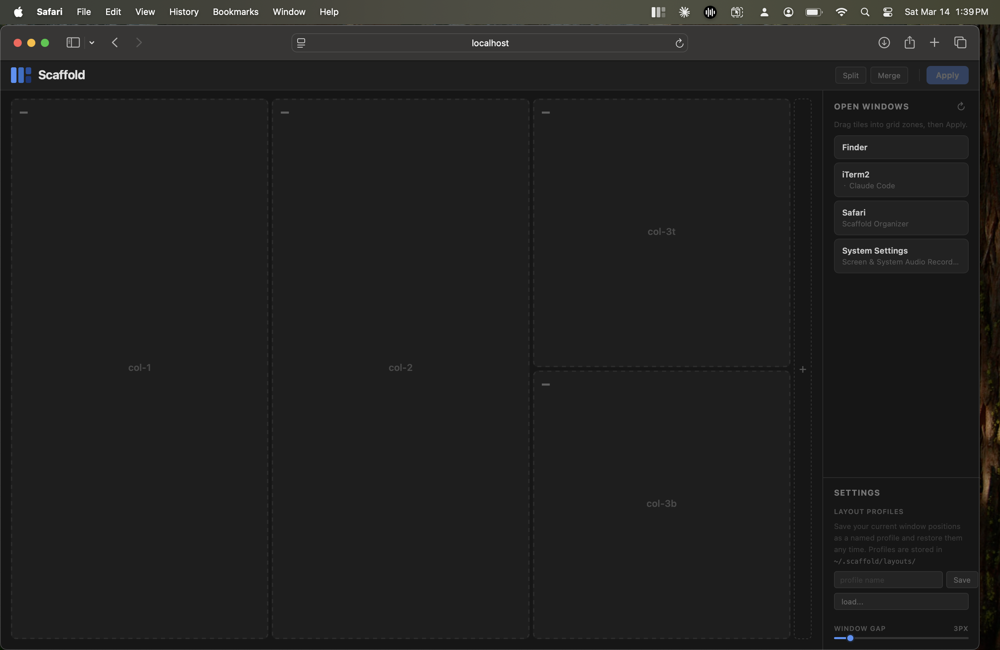

# Scaffold

**Tame window chaos on an ultrawide monitor.**



If you're running many AI agents, terminals, browsers, and monitoring tools simultaneously on a large display, Scaffold keeps every window exactly where it belongs. Define a column grid, drag windows into zones, hit Apply — and your whole workspace snaps into place in one shot. Save it as a named profile and restore it any time.

---

## Why Scaffold

Modern AI-assisted workflows often involve a dozen or more concurrent windows: multiple agent terminals, browser tabs showing outputs, log viewers, chat interfaces, email, and monitoring dashboards — all running in parallel on a wide display. Manually dragging and resizing these every session is friction that compounds over time.

Scaffold solves this with a visual drag-and-drop organizer built specifically for ultrawide monitors. You define a column grid, split columns into top/bottom rows, drag your open windows into the right zones, and apply everything at once. The grid config and window layouts persist so restoring your exact setup takes one click.

---

## Features

- **Visual organizer** — browser-based drag-and-drop UI; drag window tiles into grid zones and Apply
- **Flexible column grid** — add/remove columns, merge adjacent columns, split columns into top/bottom rows
- **Layout profiles** — save and restore named snapshots of all window positions
- **Menu bar app** — lives in your menu bar with no Dock icon; optional Open at Login
- **Adjustable window gap** — slider from 0–32px, persisted to config
- **CLI** — `scaffold snap`, `scaffold save-layout`, `scaffold restore-layout` for scripting
- **Zero native dependencies** — pure Python + PyObjC; no Xcode or Electron required

---

## Requirements

- macOS Ventura 13+ (uses `NSScreen`, `AXUIElement`, `CGWindowList`)
- Python 3.11+
- [uv](https://docs.astral.sh/uv/) (recommended) or pip

---

## Installation

```bash
git clone https://github.com/mariobollini/scaffold.git
cd scaffold

uv venv
source .venv/bin/activate
uv pip install -e .

# Add to PATH permanently
echo 'export PATH="$HOME/dev/scaffold/.venv/bin:$PATH"' >> ~/.zshrc
source ~/.zshrc
```

### Grant Accessibility permission

Scaffold uses the macOS Accessibility API to move windows. On first launch it will prompt automatically. If the prompt doesn't appear:

1. Open **System Settings → Privacy & Security → Accessibility**
2. Click **+** and add your terminal app or the Python binary from `.venv/bin/python`
3. Enable the toggle

That's it — no manual config file needed. Scaffold creates `~/.scaffold/config.yaml` with a working 4-column default on first run.

---

## Getting started

### Option A — Menu bar (recommended for daily use)

```bash
scaffold menubar
```

This is the best way to run Scaffold day-to-day. A grid icon appears in your menu bar. No terminal window needs to stay open. Use **Open at Login** from the menu to start Scaffold automatically at every login.

### Option B — One-off from the terminal

```bash
scaffold organize
```

Opens the organizer in the browser and runs the server in your terminal session. The server stays alive as long as the terminal is open. Useful for a first look or occasional use without keeping the menu bar item running.

---

## The Organizer

Open it from the menu bar icon or via `scaffold organize`.

- **Drag** window tiles from the right panel into grid zones
- **Apply** — all assigned windows snap to their zones simultaneously
- **Split** — click a zone (or click a zone then Split) to divide it into top/bottom rows
- **Merge** — click two adjacent zones to combine them into a wider span
- **+ / ×** — add or remove columns; changes save automatically
- **Save / Load** — named layout profiles in `~/.scaffold/layouts/`
- **Window Gap slider** — adjust spacing between windows (0–32px)

**Tile-first workflow:** click a zone first, then click Split or Merge — the buttons relabel to show exactly what will happen (Unsplit / Unmerge) before you commit.

---

## Config reference

Auto-created at `~/.scaffold/config.yaml` on first run:

```yaml
display:
  name: ""      # substring match against display name; empty = primary display
  columns: 4    # number of columns in the grid
  gap: 8        # pixels between zone edges
  margin: 0     # pixels inset from screen edges

zones:
  col-1:  { cols: [1], rows: full   }
  col-2:  { cols: [2], rows: full   }
  col-3:  { cols: [3], rows: full   }
  col-4t: { cols: [4], rows: top    }
  col-4b: { cols: [4], rows: bottom }
```

**`cols`** — 1-indexed column numbers. `[1, 2]` spans two adjacent columns.
**`rows`** — `full`, `top` (upper half), or `bottom` (lower half).
**`name`** — leave empty to use the primary display. To target a specific monitor, set a substring of its name. Find yours with:

```bash
python3 -c "from Cocoa import NSScreen; [print(s.localizedName()) for s in NSScreen.screens()]"
```

The organizer UI writes back to this file automatically when you add/remove columns, merge/split zones, or adjust the gap slider.

---

## CLI reference

```bash
# Snap a window to a named zone
scaffold snap col-1                         # frontmost window
scaffold snap col-2 Terminal                # frontmost Terminal window
scaffold snap col-4t Chrome "Claude.ai"     # Chrome tab by title

# Layout profiles
scaffold save-layout morning                # snapshot all windows
scaffold restore-layout morning             # restore all positions
scaffold list-layouts                       # show saved profiles
```

---

## Login item

The easiest way: run `scaffold menubar` and select **Open at Login** from the menu. It installs a LaunchAgent and the checkmark persists across launches.

To install manually:

```bash
# Replace /path/to with your actual venv path
cat > ~/Library/LaunchAgents/com.scaffold.menubar.plist << 'EOF'
<?xml version="1.0" encoding="UTF-8"?>
<!DOCTYPE plist PUBLIC "-//Apple//DTD PLIST 1.0//EN"
  "http://www.apple.com/DTDs/PropertyList-1.0.dtd">
<plist version="1.0">
<dict>
  <key>Label</key><string>com.scaffold.menubar</string>
  <key>ProgramArguments</key>
  <array>
    <string>/path/to/.venv/bin/python</string>
    <string>-m</string><string>scaffold</string><string>menubar</string>
  </array>
  <key>RunAtLoad</key><true/>
</dict>
</plist>
EOF

launchctl load ~/Library/LaunchAgents/com.scaffold.menubar.plist
```

---

## File locations

| Path | Contents |
|------|----------|
| `~/.scaffold/config.yaml` | Zone grid, display settings, gap |
| `~/.scaffold/layouts/<name>.json` | Saved window layout profiles |
| `~/.scaffold/menubar.log` | Menu bar app log |
| `~/Library/LaunchAgents/com.scaffold.menubar.plist` | Login item (if enabled) |

---

## Troubleshooting

**"No windows found"** — Click ↻ Refresh. If still empty, check Accessibility permission and make sure your terminal or Python binary is listed.

**Windows don't move after Apply** — Accessibility may be granted for Terminal but not for the Python binary in your venv. Check `http://localhost:7890/api/debug` for diagnostics.

**Wrong display targeted** — Set `display.name` in `config.yaml` to a substring of your monitor's name (find it with the one-liner above).

**Organizer shows stale UI** — Hard-refresh with ⌘⇧R to bypass cache.

**Chrome windows not matched by title** — Scaffold matches Chrome by the active tab's title; make sure the target tab is frontmost in that window.

---

## How it works

- **Accessibility API (AXUIElement)** — reads window titles/positions/sizes and sets frames. Requires Accessibility permission.
- **Quartz CGWindowList** — cross-references on-screen windows to filter out background system windows (e.g. Finder's desktop layer).
- **Flask/Waitress server** — runs locally on port 7890; the organizer is a single-page HTML file served from it. Window moves happen server-side on Apply.

---

## Project layout

```
scaffold/
├── __main__.py          # CLI entry point
├── config.py            # config loading, auto-create defaults
├── windows.py           # AX window enumeration and frame setting
├── zones.py             # zone geometry (column grid → pixel rects)
├── layout.py            # save/restore layout profiles
├── server.py            # Flask API server
├── static/
│   └── organizer.html   # entire organizer UI (single file)
└── cli/
    ├── organize.py      # `scaffold organize`
    ├── menubar.py       # `scaffold menubar` + login item
    ├── snap.py          # `scaffold snap`
    ├── save_layout.py
    ├── restore_layout.py
    └── list_layouts.py
```

---

## Contributing

Issues and PRs welcome. The codebase is intentionally small — no framework, no abstraction layers beyond what's needed.

---

## License

MIT — see [LICENSE](LICENSE).
